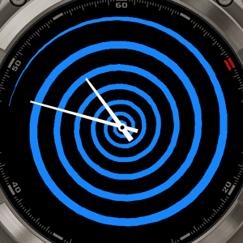
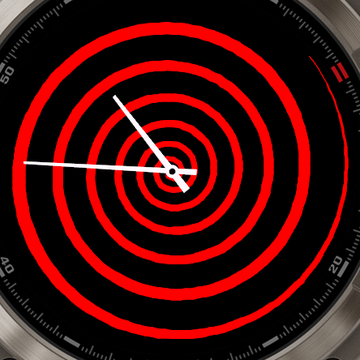
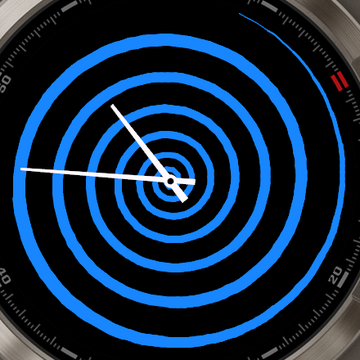
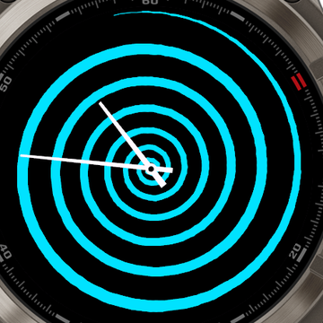
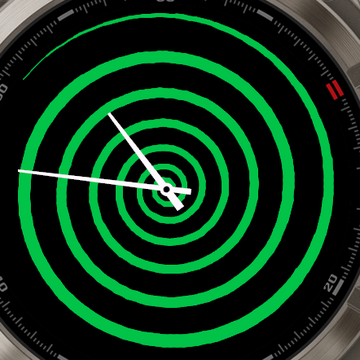
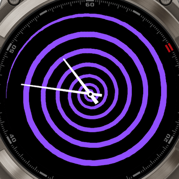

# Spiral

An animated analog watch face for Garmin Connect IQ. A blue/red spiral rotates
slowly behind white hour & minute hands, giving the illusion of rings expanding
outward. Background, spiral, and hand colors are all user-configurable.

- **Spiral** — power-law spiral (`r = R·u²`), spin clockwise, outer tail tapers to a point
- **Hands** — tapered hour/minute polygons + center hub (optional second hand)
- **Colors** — independent pickers for spiral, hands, background
- Auto-scales to every supported screen size (sized off `dc.getWidth()/getHeight()`)

## Preview



*Spiral spins clockwise while the rings appear to expand outward (fēnix 8 Pro, simulator).*

The spiral color is configurable — a few of the built-in options:

| Red | Blue | Cyan | Green | Purple |
|:---:|:---:|:---:|:---:|:---:|
|  |  |  |  |  |

## Supported devices

Spiral targets **round** Garmin watches on **CIQ 5.2 / 6.0** (AMOLED) and
**CIQ 5.2** (MIP). All listed variants share the same render path and are
enabled in `manifest.xml`.

### AMOLED round

| Family | Variants (device id) | Resolution |
|---|---|---|
| fēnix 8 | 43 mm `fenix843mm`, 47 mm `fenix847mm` | 416 / 454 |
| fēnix 8 Pro | 47/51 mm / MicroLED `fenix8pro47mm` | 454 |
| epix (Gen 2) | `epix2` | 416 |
| epix Pro (Gen 2) | 42 mm `epix2pro42mm`, 47 mm `epix2pro47mm`, 51 mm `epix2pro51mm` | 390 / 416 / 454 |
| Venu 3 | `venu3`, 3S `venu3s` | 454 / 390 |
| Venu 4 | 41 mm `venu441mm`, 45 mm `venu445mm` | 390 / 454 |
| Forerunner 965 | `fr965` | 454 |
| Forerunner 265 | `fr265`, 265S `fr265s` | 416 / 360 |
| Forerunner 165 | `fr165`, Music `fr165m` | 390 |

### MIP round

| Family | Variants (device id) | Resolution |
|---|---|---|
| fēnix 7 | `fenix7`, 7 Pro `fenix7pro` / `fenix7pronowifi` | 260 |
| fēnix 7S | `fenix7s`, 7S Pro `fenix7spro` | 240 |
| fēnix 7X | `fenix7x`, 7X Pro `fenix7xpro` / `fenix7xpronowifi` | 280 |
| fēnix 8 Solar | 47 mm `fenix8solar47mm`, 51 mm `fenix8solar51mm` | 260 / 280 |
| Forerunner 955 | `fr955` (incl. Solar) | 260 |
| Forerunner 255 | `fr255`, Music `fr255m`, 255S `fr255s`, 255S Music `fr255sm` | 260 / 218 |

**Tested in the CIQ simulator:** `fenix8pro47mm`, `venu3s`, `fr265`, `fr265s`,
`fr955`, `fenix7s`, `fenix7x` — 7/7 pass (spiral renders + animates). See
`test-report.html` and `screenshots/` for proof.

## Not supported (by design)

| Excluded | Reason |
|---|---|
| **Instinct** (2 / 3 / E / Crossover) | 2-color / limited-palette display maps the colored spiral to the background — the spiral becomes invisible. Would need a dedicated white, single-width variant. |
| **Square / rectangular** (Venu Sq, Venu X1) | The spiral fills a circle; corners would be empty. |
| **Older MIP** (fēnix 6, FR 245/945, etc., < CIQ 5) | Low refresh budget makes the animation choppy; not in scope. |

## Settings

Configurable in the Garmin Connect / Connect IQ app (or the simulator's
persistent-storage editor):

- **Spiral Color / Hand Color / Background Color** — Red · Blue · Cyan · Green · Purple · Orange · Yellow · White · Black
- **Rotation Speed** — Slow · Medium · Fast
- **Show Second Hand** — on/off (uses the spiral color)

## Build & run

```bash
SDK=~/Library/Application\ Support/Garmin/ConnectIQ/Sdks/connectiq-sdk-mac-9.1.0

# build (pick any supported device id)
"$SDK/bin/monkeyc" -d fenix8pro47mm -f monkey.jungle \
    -o bin/Spiral.prg -y keys/developer_key.der -w

# run in the simulator
"$SDK/bin/connectiq" &
"$SDK/bin/monkeydo" bin/Spiral.prg fenix8pro47mm
```

## Notes

- **MIP animation** runs smoothly in the simulator, but real MIP hardware
  throttles watch-face redraws. Consider gating the spin to AMOLED with a static
  fallback before wide MIP release; validate on ≥1 physical MIP unit.
- **Always-on (AOD):** animation pauses; only thin hands are drawn to keep lit
  pixels low on AMOLED.
- Adding a color is one line in `colorFor()` (`source/SpiralView.mc`) plus one
  `<listEntry>` per picker in `resources/settings.xml`.
