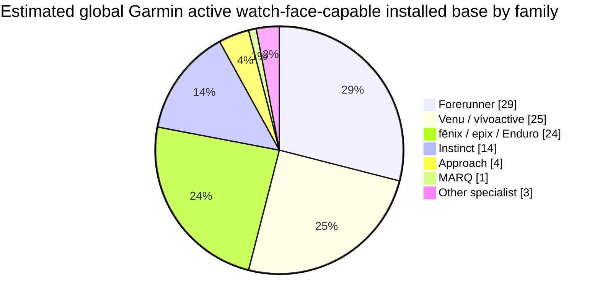
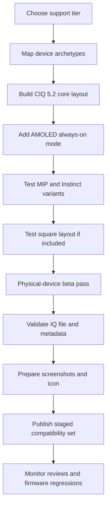

# Garmin Connect IQ Watch Face Support Strategy for Maximum Reach in June 2026

## Executive summary

Garmin does **not** publish model-level active installed-base data for its watches, and even overall active Garmin Connect users are not officially disclosed in a current annual-report style metric. The strongest public estimate I found is an external analyst estimate of **about 45 million active Garmin Connect users in 2026**, with a defensible range of **42–49 million**; Garmin’s own 2025 annual report does confirm that the company sold **20.7 million total units** in 2025 and that **Fitness** and **Outdoor** were its two largest segments, with growth driven specifically by **wearables** and **adventure watches**. Garmin’s 2025 geographic sales mix was **47.7% Americas, 37.8% EMEA, and 14.5% APAC**, which is the cleanest public regional prior available. citeturn44search0turn15view0turn16view1turn16view2

For Connect IQ watch-face reach, the active Garmin base is concentrated in four family groups: **Forerunner**, **Venu/vívoactive**, **fēnix/epix/Enduro**, and **Instinct**. My central estimate is that these four groups account for roughly **92%** of Garmin’s active watch-face-capable watch users, with the balance in **Approach**, **MARQ**, and smaller specialist families. Within those groups, the most important public-volume and momentum signals point to **Forerunner 255/265-era devices**, **Venu 3-era devices**, **fēnix 7 / fēnix 6 / epix Gen 2-era devices**, and **Instinct 2-era devices** as the most important support targets. IDC and Omdia both point to Garmin’s growth being helped by **more-accessible Forerunner models** and a **dual-generation fēnix strategy**, while Counterpoint shows Garmin was the **second-highest-selling smartwatch brand in North America** in Q2 2025. Garmin’s own launch cadence also supports this concentration, because these families had large-volume launches from 2021 through 2025 and remain heavily represented on the Connect IQ compatibility roster. citeturn29search0turn29search9turn31search1turn13search5turn35search0turn35search5turn11search0turn11search1turn13search2turn12search2turn11search2turn39search0turn42search0turn43search0

If your goal is a **minimal practical support matrix**, the best answer is not “support every Garmin watch” but “support the few runtime-and-display archetypes that correspond to the biggest families.” My recommendation is: aim first for a **~70% tier** centered on **CIQ 5.2 round AMOLED + CIQ 5.2 round MIP + CIQ 3.4 monochrome Instinct**, then expand to an **~80% tier** by adding **legacy CIQ 5.0/3.3/3.4 mainstream devices and a square layout**, and only then pursue a **~90% tier** by adding **CIQ 5.1/6.0 new-gen devices plus golf/luxury niches**. The jump from ~80% to ~90% coverage is real, but it comes with sharply rising testing and screenshot complexity. citeturn39search0turn42search0turn43search0turn22search1turn22search0

## Evidence and methodology

Because Garmin does not publish a model-by-model active watch base, this report uses a **proxy model** rather than pretending that precise public counts exist. The model is built from five source classes: Garmin official financial and product-launch disclosures; Garmin official Connect IQ compatibility/runtime data; industry shipment/rank signals from IDC, Omdia, and Counterpoint; Connect IQ Store popularity signals; and developer/community evidence about which devices matter operationally. The resulting percentages are therefore **modeled estimates**, not audited Garmin figures. citeturn15view0turn29search0turn29search9turn31search1turn37search18turn37search1turn38search4

The core official anchors are unusually useful even though they are incomplete. Garmin’s 2025 annual report shows **20.7 million total units sold** and confirms that **Fitness** became the largest segment in 2025 at **33% of revenue**, while **Outdoor** remained very large at **28%**; Garmin explicitly attributed Fitness growth to **strong demand for wearables** and Outdoor growth to **adventure watches**. That is the strongest official signal that the installed base relevant to Connect IQ watch faces is dominated by Forerunner/Venu/vívoactive-like devices on the Fitness side and fēnix/epix/Instinct-like devices on the Outdoor side. citeturn15view0

Industry trackers sharpen that picture. IDC said Garmin **returned to the global top five** in wrist-worn devices in Q1 2025 and explicitly linked that performance to **more-accessible Forerunner models** and a **dual-generation fēnix strategy**. Omdia reported Garmin shipped **1.8 million wearable-band units in Q1 2025**, up **10% year over year**, and also highlighted Garmin’s differentiated portfolio and its ability to upsell across price tiers. Counterpoint separately reported that in **North America** Garmin was the **second highest-selling smartwatch brand** in Q2 2025, behind Apple and ahead of Samsung. Those three datapoints together strongly suggest that the biggest current volume pools are not MARQ or Approach; they are mainstream Forerunner, mainstream/premium fēnix, and adjacent everyday-wellness lines. citeturn29search0turn29search9turn31search1

Launch timing matters because installed base is cumulative. The big active cohorts were launched in repeated waves: **Venu 2** in April 2021; **fēnix 7** and **epix (Gen 2)** in January 2022; **Instinct 2** in February 2022; **Forerunner 255/955** in June 2022; **Forerunner 265/965** in March 2023; **fēnix 7 Pro** and **epix Pro** in May 2023; **Venu 3** in August 2023; **vívoactive 5** in September 2023; **Forerunner 165** in February 2024; **fēnix 8** in August 2024; **Instinct 3** in January 2025; **vívoactive 6** in April 2025; **Forerunner 570/970** in May 2025; **Venu 4** in September 2025; and **Forerunner 70/170** in May 2026. That sequence implies that mid-priced and premium watches launched from 2022 to 2025 now dominate the active watch-face audience, while 2026 launches are too new to have accumulated major installed base as of June 2026. citeturn13search5turn35search0turn12search0turn35search5turn13search0turn11search0turn12search1turn12search17turn11search1turn13search2turn36search0turn12search2turn11search2turn11search10turn36search4turn11search7turn11search3

Connect IQ Store popularity gives a useful behavioral check. The most popular watch-face listings I found were broad-market, information-rich faces such as **GLANCE** with **1M+ downloads**, while multiple other faces such as **Rails**, **EASY Round**, **Teko**, and **Digic** were in the **500K+** class. That does not identify device mix directly, but it does confirm that Garmin’s watch-face audience is large enough that broad compatibility and configuration depth are rewarded. citeturn37search18turn37search1turn37search19turn37search13turn37search16

## Estimated installed-base mix

The percentages below are **modeled estimates of the active Garmin watch-face-capable watch base**, not Garmin-published user counts. They are the most defensible synthesis I can make from Garmin segment data, launch timing, runtime-compatibility pages, shipment/ranking trackers, and app-store/community proxies. I recommend treating them as **planning estimates with roughly ±3 percentage points uncertainty** on the largest families and wider error bands on minor families. citeturn15view0turn29search0turn29search9turn31search1turn39search0turn42search0turn43search0turn44search0

| Family | Estimated share of active Garmin watch users | Representative high-importance models | Key compatibility notes for watch faces | Source basis |
|---|---:|---|---|---|
| **Forerunner** | **29%** | FR 55, 165, 255/255S, 265/265S, 955, 965, 570, 970, 70, 170 | Covers **208×208 MIP 8-color CIQ 3.4**, **218–260 MIP 64-color CIQ 5.2**, and **360/390/416/454 AMOLED CIQ 5.2–6.0**. This is the single most important support family for reach. | Garmin launches and runtime data, plus IDC/Omdia growth callout for accessible Forerunners. citeturn13search0turn11search0turn36search0turn36search4turn11search3turn39search0turn42search0turn29search0turn29search9 |
| **Venu and vívoactive** | **25%** | Venu 2/2S/2 Plus, Venu 3/3S, Venu 4, vívoactive 4/5/6, Venu Sq 2, Venu X1 | Mostly **AMOLED**, spanning **360/390/416/454 round** and **320×360 / 448×486 rectangular** layouts, on **CIQ 5.0–6.0**. Square/rectangular support becomes important beyond the core tier. | Garmin launches and CIQ compatible-device data. citeturn13search5turn11search1turn11search7turn13search2turn11search10turn35search3turn41search0turn42search0turn43search0 |
| **fēnix, epix, Enduro, tactix, quatix** | **24%** | fēnix 6/7/7 Pro/8 Solar/8 AMOLED, epix Gen 2/Pro, Enduro 2/3, tactix, quatix | The main premium outdoor block. Mixes **240/260/280 MIP 64-color** and **390/416/454 AMOLED**, across **CIQ 3.4, 5.2, and 6.0**. High-value cohort, especially in the U.S. | Garmin launches, CIQ compatibility data, IDC/Omdia emphasis on dual-generation fēnix strategy. citeturn35search0turn12search0turn12search1turn12search17turn12search2turn42search0turn43search0turn29search0turn29search9 |
| **Instinct** | **14%** | Instinct 2/2S/2X, Crossover, Instinct 3 Solar/E, Instinct 3 AMOLED | Operationally critical because it introduces the **semi-octagon 2-color 163×156 / 176×176** branch on **CIQ 3.4 or 5.1**, plus newer **390/416 AMOLED** variants. Often needs a simplified layout. | Garmin launches and CIQ compatibility data; community and review coverage confirm strong popularity. citeturn35search5turn11search2turn39search0turn42search0turn14search11 |
| **Approach** | **4%** | S62, S70 42/47, S50 | Small but real golf segment. Mixes **260 MIP CIQ 3.0** and **390/454 AMOLED CIQ 5.1**. Support matters only in the ~90% tier unless golf is a target market. | Garmin launches and CIQ compatibility data. citeturn11search10turn43search0 |
| **MARQ** | **1%** | MARQ Gen 2 | Tiny by volume, high by ASP. Mostly **390 AMOLED CIQ 5.2** on Gen 2. Usually not worth first-wave support unless your face is luxury-themed. | Garmin press release and CIQ compatibility data. citeturn12search17turn13search6turn42search0 |
| **Other specialist watch-capable families** | **3%** | Descent, D2, Disney/licensed, older specialist lines | Long tail. Real devices, low reach. Useful only after mainstream coverage is already strong. | CIQ compatibility and Garmin launch/support pages. citeturn42search0turn43search0 |

The chart above is a **modeled family-share estimate** derived from Garmin’s segment mix, Garmin’s launch cadence, CIQ runtime/device coverage, IDC/Omdia shipment signals, Counterpoint’s North America ranking, and Connect IQ Store popularity signals. citeturn15view0turn29search0turn29search9turn31search1turn39search0turn42search0turn43search0turn37search18

Regional differences are real, but public data are much thinner here than for global family mix. My best estimate is that the **U.S. over-indexes on fēnix/epix and Instinct**, **Europe over-indexes on Forerunner**, and **APAC over-indexes on Venu/vívoactive** relative to Garmin’s global family mix. That inference comes from Garmin’s own geography, IDC’s note that the U.S., Western Europe, and APAC ex-India were key recovery regions, and Counterpoint’s evidence that Garmin was especially strong in North America. citeturn16view1turn16view2turn29search0turn31search1

| Region | Modeled family mix inside the region |
|---|---|
| **United States** | Forerunner **28%**, fēnix/epix/Enduro **27%**, Venu/vívoactive **21%**, Instinct **16%**, Approach **5%**, MARQ/other **3%** |
| **Europe** | Forerunner **32%**, fēnix/epix/Enduro **24%**, Venu/vívoactive **24%**, Instinct **11%**, Approach **6%**, MARQ/other **3%** |
| **APAC** | Venu/vívoactive **30%**, Forerunner **28%**, fēnix/epix/Enduro **19%**, Instinct **13%**, Approach **5%**, MARQ/other **5%** |

The regional table is intentionally presented as a **planning model**, not fact. Garmin’s public geographic disclosures are at the company level, not the watch-family level, so the table should be used to prioritize testing and screenshots, not as a claim of audited regional market share. citeturn16view1turn16view2turn29search0turn31search1

## Recommended support tiers

### Baseline coverage

For a first release intended to maximize reach without creating an unmanageable QA burden, I would target a **~70% tier** built around these device buckets:

- **Forerunner core modern set:** FR 255/255S/955 plus FR 165/265/265S/965. This covers the main modern running cohort across **MIP** and **AMOLED**, the key **5.2-era** runner base, and the most important screen sizes from **218×218** through **454×454**. citeturn39search0turn42search0
- **Everyday AMOLED core:** Venu 3/3S and vívoactive 5. This gives you the mainstream wellness audience on **390×390** and **454×454 AMOLED** with **CIQ 5.2**. citeturn11search1turn13search2turn42search0turn43search0
- **Premium outdoor core:** fēnix 7 / 7 Pro / 7X Pro plus epix Gen 2 / epix Pro. This captures the biggest premium outdoor cohort across **240/260/280 MIP** and **390/416/454 AMOLED** on **CIQ 5.2**. citeturn35search0turn12search1turn12search17turn42search0
- **Rugged monochrome core:** Instinct 2 / 2S / 2X / Crossover. This is the one non-negotiable long-pole branch if you want broad Garmin reach, because the Instinct line uses a separate **2-color semi-octagon** design language. citeturn35search5turn39search0

That set should get you to roughly **72–75%** of active Garmin watch users in practice. The biggest trade-off is that you will still miss many **legacy mainstream devices** and most **square/rectangular** users. If your design is strongly round-centric, that is usually a good first trade. citeturn15view0turn29search0turn29search9turn39search0turn42search0turn43search0

### Broad coverage

To reach **~80% coverage**, I would add the still-material older mainstream cohorts and one square layout:

- **Add legacy mainstream wellness:** Venu 2 / 2S / 2 Plus, vívoactive 4 / 4S. These devices are older than the Venu 3/vívoactive 5 set, but they remain widely compatible and still matter in the active installed base. citeturn13search5turn42search0turn43search0
- **Add older premium outdoor:** fēnix 6 / 6S / 6X Pro. The fēnix 6 generation is old enough that it is no longer a “new sales” story, but large enough that it still matters for active installs. citeturn42search0
- **Add older budget/midrunner:** FR 55, FR 245, FR 745, FR 945 LTE. These pick up legacy runners that still install watch faces but sit outside the modern 5.2 core. citeturn39search0turn42search0
- **Add one square branch:** Venu Sq 2 / Venu Sq 2 Music. This is the simplest way to stop losing square-layout users while staying in the mainstream wellness cohort. citeturn35search3turn43search0

That expansion should take you to roughly **81–84%** coverage. This is the best balance point for most commercial watch-face developers: most of the upside of wide support, without the QA explosion of every niche and every brand-new runtime. citeturn43search0turn29search0turn29search9

### Long-tail coverage

To approach **~90% coverage**, you have to accept diminishing returns and support the long tail of **new runtimes**, **new layouts**, and **niche families**:

- **Add CIQ 6.0 premium outdoor:** fēnix 8 AMOLED, fēnix 8 Solar, fēnix E, Enduro 3, tactix 8, quatix 8. These increase forward coverage but add more permutations. citeturn12search2turn42search0
- **Add CIQ 5.1/6.0 rugged refresh:** Instinct 3 AMOLED, Instinct 3 Solar, Instinct E. These are important if you want future-proof rugged coverage, but installed base was still building in mid-2026. citeturn11search2turn39search0turn42search0
- **Add 2025–2026 mainstream refreshes:** Venu 4, vívoactive 6, Venu X1, Forerunner 570/970 and 70/170. These matter more for forward compatibility than for past installed base. citeturn11search7turn11search10turn41search0turn36search4turn11search3turn42search0turn43search0
- **Add golf and luxury niche:** Approach S50/S70 and MARQ Gen 2. Important only if golf or premium aesthetics are part of your audience. citeturn43search0turn13search6turn42search0

This tier should get you to roughly **90–92%** coverage, but it is where complexity spikes. The extra ~8–10 points of reach require disproportionately more screenshots, more conditional layouts, more beta testing, and more firmware-regression risk. If your app economics are modest, **~80% is usually the rational stopping point**. citeturn38search9turn24search1turn23search2

## Compatibility testing checklist

- **Build your support matrix around device archetypes, not marketing names.** The minimum meaningful test grid is: **Instinct 2** for 2-color semi-octagon, **FR 55** for low-end 208×208 MIP, **FR 255 or 955** for 260×260 MIP, **fēnix 7S / 7 / 7X** for 240/260/280 MIP sizes, **FR 265S / 265** for 360/416 AMOLED, **Venu 3S / 3** for 390/454 AMOLED, and **Venu Sq 2** if you want square coverage. If you are doing the long-tail tier, add **Venu X1** for the 448×486 rectangle and **fēnix 8 / FR 970** for CIQ 6.0. citeturn39search0turn42search0turn43search0
- **Treat CIQ 5.2 as the modern baseline**, then explicitly decide whether you will also carry **CIQ 3.4** for FR 55 / older fēnix / Instinct 2 and **CIQ 5.1/6.0** for 2025–2026 refreshes. This one decision largely determines your engineering cost. citeturn39search0turn42search0turn43search0
- **Implement proper AMOLED always-on behavior.** Garmin explicitly recommends always-on adaptation for AMOLED watch faces and warns that many existing faces will trip the **burn-in protector** if they are not designed for it. citeturn23search8turn22search1turn22search0
- **Design for low-power constraints first.** Garmin’s docs state that watch faces run under many constraints because they operate in **low power mode**; Garmin’s API docs also show that watch faces update **once per minute in low power mode** and **once per second in high power mode**. citeturn17search0turn20search2turn21view5
- **Be disciplined about resources.** Garmin’s API documentation says resources should be loaded in **onLayout/onShow** and freed on **onHide**. On watch faces, that is not optional polish; it is directly connected to stability on lower-end and legacy devices. citeturn21view5
- **Do not trust emulator-only validation for broad device support.** Garmin developer forum posts document cases where a watch face worked in the emulator but then failed on real devices, including Venu-family devices. Be conservative about adding support boxes until you have at least emulator coverage plus some physical-device validation in that family. citeturn38search4
- **Gate advanced update paths by capability.** Garmin developer guidance and forum history show that 1 Hz behavior and partial update behavior have device dependencies; if you expose seconds or animated elements, keep them conditional rather than assuming they work everywhere. citeturn38search1turn24search8
- **Plan separate visual rules for Instinct.** The Instinct family is not just “a smaller round watch”; it is a different screen shape, a different color model, and a different aesthetic expectation. In practice, the best Instinct faces usually simplify typography, iconography, and data density. citeturn39search0turn42search0
- **Keep unsupported metrics optional.** Garmin’s complications guidance makes clear that devices surface many data points to the watch face, but not every metric exists on every device. Null-check everything and hide or substitute fields gracefully rather than letting the layout break. citeturn23search6
- **Use on-device configuration where it helps.** Garmin’s watch-face configuration guidance allows users to save up to **four configurations** on-device. Use that for color theme, complications density, and “Instinct-safe” simplified modes rather than forcing separate binaries for small variants. citeturn17search16

Garmin’s publishing workflow requires the validated IQ file to be followed by a **description, screenshots, and other store details**, so it is efficient to think of testing and store-asset generation as one continuous release pipeline rather than separate activities. citeturn24search1

## Store listing strategy

A good Garmin watch-face listing should sell *compatibility confidence* as much as it sells aesthetics. The Connect IQ Store’s own top-download watch faces are almost all highly configurable, highly legible, and obviously broad-market. **GLANCE** at **1M+ downloads** and faces such as **Rails**, **EASY Round**, **Teko**, and **Digic** at **500K+ downloads** all point in the same direction: broad compatibility, data richness, and clear value proposition matter more than novelty alone. citeturn37search18turn37search1turn37search19turn37search13turn37search16

The biggest store mistake to avoid is overclaiming compatibility. Garmin’s own developer forum contains examples of developers getting hit by reviews after enabling devices that passed emulator tests but failed in the field. For that reason, I recommend **publishing in staged waves** that mirror the support tiers in this report rather than checking every device box up front. citeturn38search4

For listing assets and metadata, I would use this structure:

- **Icon:** Garmin’s brand guidance says that for watch faces, using a **preview of the watch face as the app icon** often works best, and it specifies **128×128 px, sRGB** for the on-device app icon. citeturn23search2
- **Title and description keywords:** Use straightforward descriptors that match the categories in Garmin’s own product families and user search intent, such as **digital**, **data-rich**, **AMOLED always-on**, **battery-efficient**, **running**, **outdoor**, **Instinct**, **Forerunner**, **fēnix**, **minimal**, or **large digits**. This is my recommendation, but it is strongly supported by how the popular Connect IQ faces describe themselves. citeturn37search1turn37search13turn37search18
- **Screenshots:** Garmin’s publishing flow requires screenshots; I recommend at least one screenshot for each archetype you actually support: **390 AMOLED round**, **454 AMOLED round**, **260 MIP round**, **176 monochrome Instinct**, and **square AMOLED** if applicable. The goal is to prevent a buyer on an Instinct or Venu Sq from assuming the round flagship screenshot is what they will get. citeturn24search1turn39search0turn42search0turn43search0
- **Compatibility copy:** Explicitly say whether the face supports **AMOLED always-on**, whether the **Instinct layout is simplified**, and whether some metrics may be hidden on devices that do not expose the same data. That reduces avoidable one-star reviews. citeturn22search1turn23search6
- **Release notes:** Keep them current, because Garmin forum posts show firmware updates can break previously working watch faces, especially on higher-end devices. citeturn38search9

My strongest practical suggestion is to consider **two store SKUs** if your design is strongly visual: one **mainstream color version** for round AMOLED/MIP families, and one **Instinct-specific mono version**. The semi-octagon monochrome branch is different enough that forcing it into the same visual personality often produces weaker reviews, weaker screenshots, and more layout compromises than it is worth. The CIQ compatibility matrix makes those differences very clear. citeturn39search0turn42search0turn43search0

## Open questions and limitations

The main unresolved issue is simple: **Garmin does not publicly disclose model-level active users**, and it does not publicly disclose an official 2026 Garmin Connect active-user count in the same way some consumer platforms do. The **45 million** figure is therefore an external estimate, not a Garmin-issued KPI. citeturn44search0

Relatedly, the **regional family splits** in this report are modeled from Garmin’s overall geography and public market signals, not from a Garmin regional wearable census. They are useful for prioritization, but not precise enough to be treated as accounting-grade market-share figures. citeturn16view1turn16view2turn29search0turn31search1

Finally, Garmin’s public Connect IQ materials make screen sizes, color technologies, and CIQ/API levels relatively easy to cite, but publicly citable **per-device memory ceilings** were not cleanly exposed in the accessible docs I could retrieve. For that reason, the performance and memory guidance in this report is conservative and qualitative rather than a table of exact limit numbers. citeturn17search0turn21view5turn39search0turn42search0turn43search0